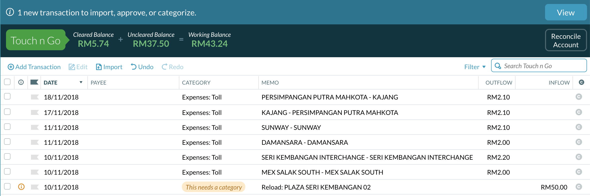

# touchngo-ynab-sync

Import your Touch 'N Go transactions into [YNAB](http://app.youneedabudget.com) using [touchngo-scraper](https://github.com/hasyimibhar/touchngo-scraper).

## Usage

### Using go run

```sh
$ export YNAB_ACCESS_TOKEN=XXXX
$ export YNAB_BUDGET_ID=XXXX
$ export YNAB_ACCOUNT_ID=XXXX
$ export YNAB_TOUCHNGO_CATEGORY_ID=XXXX
$ export TOUCHNGO_URL=XXXX
$ export TOUCHNGO_USERNAME=XXXX
$ export TOUCHNGO_PASSWORD=XXXX
$ export TOUCHNGO_CARD_SERIAL_NUMBER=XXXX
$ go run main.go
```

### Using docker

```sh
$ docker run --rm -it \
    -e "YNAB_ACCESS_TOKEN=XXXX" \
    -e "YNAB_BUDGET_ID=XXXX" \
    -e "YNAB_ACCOUNT_ID=XXXX" \
    -e "YNAB_TOUCHNGO_CATEGORY_ID=XXXX" \
    -e "TOUCHNGO_URL=XXXX" \
    -e "TOUCHNGO_USERNAME=XXXX" \
    -e "TOUCHNGO_PASSWORD=XXXX" \
    -e "TOUCHNGO_CARD_SERIAL_NUMBER=XXXX" \
    hasyimibhar/touchngo-ynab-sync
```

## Result


